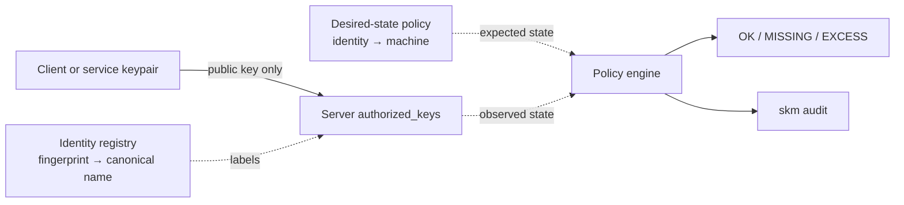

# SSH Key Manager

<p align="center">
  <strong>Local-first SSH public-key trust management for small fleets.</strong>
</p>

<p align="center">
  <a href="https://github.com/SwiftExplorer567/ssh-key-manager/actions/workflows/ci.yml"></a>
  <a href="https://github.com/SwiftExplorer567/ssh-key-manager/releases/latest"></a>
  <a href="LICENSE"></a>
  
  
</p>

SSH Key Manager (SKM) is a terminal application for understanding and managing
SSH public-key trust across a small set of Linux and macOS machines. It combines
an observed access inventory, fingerprint-based identities, desired-state
policy, SSH host-key pinning, trust auditing, configuration backup/restore,
fleet identity sync, and structured JSON output for automation.

SKM deliberately **does not move or escrow private keys** and it does not open
interactive SSH sessions. It manages public-key authorization and the metadata
needed to reason about it.

## Why SKM?

`authorized_keys` is simple on one server. Across several machines, the hard
part quickly becomes answering questions such as:

- Which public key belongs to which device or service?
- Where is that identity authorized right now?
- Where *should* it be authorized?
- Did a key disappear, appear somewhere unexpected, or remain after retirement?
- Can I audit the fleet without building a central private-key store?

SKM keeps those concerns separate and explicit.

| Layer | Question it answers | Main commands |
|---|---|---|
| Machines | What can this SKM node manage? | `skm host ...` |
| Observed access | Where is a fingerprint authorized now? | `skm access matrix` |
| Identity registry | Who/what does this fingerprint represent? | `skm identity ...` |
| Desired state | Where should that identity be authorized? | `skm policy ...` |
| Host trust | Is this SSH server still the one I pinned? | `skm host trust/verify ...` |
| Audit | Is observed trust clean and consistent? | `skm audit` |
| Fleet automation | Can I back up, sync, or script trust metadata? | `skm config ...`, `skm sync ...`, `--json` |

## Security model

The central rule is simple:

```text
private key stays on its owner
          │
          └── public key ──> destination authorized_keys
```

SKM never needs to centralize private keys. Each machine may own a dedicated
`~/.ssh/id_ed25519_skm` keypair; only the public half is copied when access is
granted.



Important security properties:

- private keys are never transferred, exported, or escrowed by SKM;
- inventory reads public-key material only (`*.pub` and `authorized_keys`);
- public keys, fingerprints, host values, ports, and identity names are validated;
- `authorized_keys` changes are locked, atomic, permissioned, and backed up;
- symlinked authorization/config targets are rejected where replacement would be unsafe;
- remote mutations use fixed embedded scripts rather than user-controlled shell commands;
- when the SKM management key exists, SSH uses it with `IdentitiesOnly=yes` so agent/default keys cannot silently satisfy management access;
- remote host keys can be pinned in SKM's private `known_hosts`; pinned hosts force strict host-key verification;
- public-key payloads travel over standard input instead of shell interpolation;
- trust configuration exports contain identities and policy metadata, not private keys or `authorized_keys`;
- there is no telemetry and updates are never installed silently;
- versioned release assets fail closed if unavailable; the installer never falls back to a moving branch;
- update downloads are SHA-256/version/syntax verified and replaced atomically;
- releases publish a source-commit manifest and GitHub build-provenance attestation for independent verification.

For security reporting and project policy, see [SECURITY.md](SECURITY.md).

## Requirements

- Linux or macOS
- Bash 3.2 or newer
- OpenSSH client tools
- `curl` for the installer/updater

CI runs the generated artifact and test suite on both Ubuntu and macOS.

## Installation

Install the latest verified release:

```bash
curl -fsSL https://raw.githubusercontent.com/SwiftExplorer567/ssh-key-manager/main/install.sh | bash
```

The installer uses `/usr/local/bin` when writable and otherwise falls back to
`~/.local/bin`. To explicitly request a system installation:

```bash
curl -fsSL https://raw.githubusercontent.com/SwiftExplorer567/ssh-key-manager/main/install.sh | bash -s -- --system
```

Verify the installation:

```bash
skm version
skm doctor
```

Run `skm` with no arguments to open the interactive dashboard.

## Quick start

### 1. Add a machine

```bash
skm host add rpi5 root 192.168.1.20 22
skm host test rpi5
```

For stronger server identity assurance, inspect the presented host-key fingerprints,
verify the expected fingerprint through an independent channel, then pin it:

```bash
skm host fingerprint rpi5
skm host trust rpi5 'SHA256:...'
skm host verify rpi5
```

`ssh-keyscan` discovers keys; it does not authenticate them by itself. See
[SSH host trust](docs/host-trust.md).

### 2. Give this machine access

```bash
skm access grant rpi5
```

If needed, SKM creates its dedicated ED25519 keypair locally and adds only the
public key to the destination.

### 3. Review observed authorization

```bash
skm key list
skm access matrix
```

The access matrix is observational:

- `yes` — fingerprint is present in that machine's `authorized_keys`;
- `no` — fingerprint is absent;
- `?` — machine could not be inspected.

`yes` does **not** mean the access is intended. Desired intent is modeled
separately with policy.

### 4. Register canonical identities

Map known SHA-256 fingerprints to stable names:

```bash
skm identity add workstation 'SHA256:...' device
skm identity add phone 'SHA256:...' device
skm identity add deploy-prod 'SHA256:...' service
```

Supported identity types are `device`, `server`, `service`, and `other`.
Identity names are metadata; the immutable fingerprint anchors the identity, so
renaming an identity does not break policy references.

```bash
skm identity list
skm identity show workstation
```

### 5. Declare desired access

```bash
skm policy expect workstation rpi5
skm policy expect phone rpi5
```

Then compare desired and observed state:

```bash
skm policy matrix
skm policy check
```

Policy cells mean:

- `OK` — expected and authorized;
- `MISSING` — expected but not authorized;
- `EXCESS` — authorized but not expected;
- `-` — neither expected nor authorized;
- `?` — the machine could not be inspected.

An empty policy preserves observed-only behavior. Once at least one rule exists,
policy is closed-world for registered **active** identities.

### 6. Audit trust

```bash
skm audit
```

The audit checks desired-state drift together with trust/hygiene findings such
as unknown authorized fingerprints, retired identities that still have access,
duplicate key material, unsafe control characters in comments, broad
`Host *`/`IdentityFile` SSH config patterns, and unreachable managed machines.

Audit is read-only; SKM does not automatically grant or revoke access in
response to a finding.

## Fleet configuration and automation

### Export and validate trust metadata

```bash
skm config export ~/skm-trust-backup.skm
skm config validate ~/skm-trust-backup.skm
```

The export is a non-executable, versioned trust bundle containing the canonical
identity registry and desired-state policy. It is written with mode `0600` and
contains no private keys or `authorized_keys` contents.

Restore after validation:

```bash
skm config import ~/skm-trust-backup.skm
```

Import validates the entire bundle before mutation, creates timestamped backups,
and replaces identity/policy metadata atomically.

### Synchronize canonical identities

```bash
skm sync identities "Mac Mini" --dry-run
skm sync identities "Mac Mini"
```

The dry run shows `ADD`, `UPDATE`, `REMOVE`, and `UNCHANGED` entries. Before any
replacement, SKM reads the remote registry and policy and refuses a sync that
would orphan a remote policy rule. Successful replacement is validated, backed
up, and written with mode `0600`.

**Policy is intentionally not synchronized.** Policy rules refer to machine
aliases local to each SKM node, so blindly copying policy between managers could
create false `MISSING`/`EXCESS` results.

### JSON output

For monitoring, cron/systemd jobs, CI, or other automation:

```bash
skm policy check --json
skm audit --json
```

Example clean result:

```json
{"command":"audit","version":"1.5.0","ok":true,"exit_code":0,"issue_count":0,"issues":[],"findings":[]}
```

JSON mode preserves the same process exit status as the human-readable command,
so drift or trust findings remain script-detectable.

See [Fleet configuration & automation](docs/fleet-automation.md) for details.

## Command reference

```text
# Machines / SSH host trust
skm host list
skm host show NAME
skm host add NAME USER HOST [PORT]
skm host edit NAME USER HOST [PORT]
skm host rename NAME NEW_NAME
skm host remove NAME [--force]
skm host test NAME
skm host fingerprint NAME
skm host trust NAME [FINGERPRINT]
skm host verify NAME
skm host untrust NAME

# Access
skm access grant NAME [KEY.pub]
skm access receive NAME
skm access link NAME [KEY.pub]
skm access status [NAME]
skm access matrix
skm access revoke NAME
skm access allow [KEY.pub|-]

# Canonical identities
skm identity list
skm identity add NAME FINGERPRINT [device|server|service|other]
skm identity show NAME
skm identity rename NAME NEW_NAME
skm identity retire NAME
skm identity activate NAME

# Desired-state policy
skm policy list
skm policy expect IDENTITY MACHINE
skm policy remove IDENTITY MACHINE
skm policy matrix
skm policy check [--json]

# Trust config / fleet
skm config export [PATH|-]
skm config validate PATH|-
skm config import PATH|-
skm sync identities MACHINE [--dry-run]

# Public keys / audit
skm key list
skm key generate [PATH] [COMMENT]
skm key public [KEY.pub]
skm audit [--json]
skm doctor

# Updates
skm update check
skm update install
skm version
```

## Interactive dashboard

Run:

```bash
skm
```

The dashboard provides goal-oriented flows for:

1. giving access;
2. managing machines;
3. reviewing keys and security;
4. inspecting access state;
5. installing updates.

Saved machines show reachable/unavailable/local status without preventing the
rest of the fleet from being inspected. Confirmation screens show the source and
destination before access-changing actions.

## Configuration files

Default locations:

| Path | Purpose |
|---|---|
| `~/.config/ssh-key-manager/servers.conf` | Saved machine inventory |
| `~/.config/ssh-key-manager/identities.conf` | Canonical fingerprint registry (`0600`) |
| `~/.config/ssh-key-manager/policy.conf` | Desired-state rules (`0600`) |
| `~/.config/ssh-key-manager/config` | Allow-listed application settings |
| `~/.config/ssh-key-manager/known_hosts` | SKM-managed pinned SSH host keys (`0600`) |
| `~/.config/ssh-key-manager/update.state` | Cached release-check state |
| `~/.ssh/id_ed25519_skm` | Local SKM private key (`0600`) |
| `~/.ssh/id_ed25519_skm.pub` | Local SKM public key |
| `~/.ssh/authorized_keys.skm.bak` | Most recent pre-change authorization backup |

Settings files are parsed as data and are not sourced as shell code.

Unpinned hosts default to OpenSSH `StrictHostKeyChecking=accept-new`: a
changed key is rejected, but a first-seen key is trusted. For security-sensitive
hosts, prefer an explicit SKM pin after independently verifying the fingerprint.
Once pinned, SKM uses its own `known_hosts`, forces `StrictHostKeyChecking=yes`,
and disables global known-host fallback for that connection.

## Updates

SKM checks the latest GitHub release at most once every 24 hours unless automatic
checks are disabled. It never installs an update without an explicit command.

```bash
skm update check
skm update install
```

The updater downloads only versioned release assets over HTTPS. Missing assets
fail closed rather than falling back to `main`. SKM verifies SHA-256, embedded
version/shebang, and `bash -n`, keeps the previous binary as `.previous`, and
replaces the executable atomically.

Each release also publishes `release-manifest.txt` with the source commit and a
GitHub build-provenance attestation. With GitHub CLI installed, a downloaded
release artifact can be independently checked with:

```bash
gh attestation verify ssh-key-manager --repo SwiftExplorer567/ssh-key-manager
```

## Project scope and non-goals

SKM is intentionally small and auditable. It is:

- a public-key inventory and authorization tool;
- an identity/fingerprint registry;
- a desired-state SSH trust checker;
- a lightweight fleet audit and automation tool.

It is **not**:

- an SSH server or interactive SSH client;
- a private-key vault or secrets manager;
- an SSH certificate authority;
- a replacement for host compromise detection or endpoint security;
- a reason to skip normal SSH hardening, backups, and least-privilege design.

## Architecture

Source is split by responsibility and bundled into one distributable Bash
executable:

| Module | Responsibility |
|---|---|
| `src/runtime.sh` | Runtime paths, settings, validation, output |
| `src/hosts.sh` | Machine persistence and host operations |
| `src/host_trust.sh` | SSH host-key discovery, pinning, and verification |
| `src/ssh_transport.sh` | SSH transport primitives and managed-identity enforcement |
| `src/access.sh` | Public-key inventory, grants, revocation |
| `src/identities.sh` | Fingerprint identity registry |
| `src/policy.sh` | Desired-state policy and drift engine |
| `src/security_display.sh` | Safe rendering of untrusted key metadata |
| `src/fleet.sh` | Export/import, sync, JSON automation |
| `src/updates.sh` | Release discovery and verified updates |
| `src/ui.sh` | Interactive terminal interface |
| `src/cli.sh` | CLI help and dispatch |
| `remote/` | Fixed remote mutation programs embedded at build time |

`build/bundle.sh` produces the committed `ssh-key-manager` executable and
`ssh-key-manager.sha256`. CI rejects stale generated output.

## Development

```bash
git clone https://github.com/SwiftExplorer567/ssh-key-manager.git
cd ssh-key-manager

make build
make check-generated
make test
make lint
make ci
```

Tests use isolated temporary HOME/config/SSH directories and do not touch the
developer's real SSH configuration.

CI validates the generated artifact, functional tests, Bash syntax, and
ShellCheck on Ubuntu and macOS. Ubuntu also starts a real isolated OpenSSH daemon
to prove that SKM cannot authenticate through an unrelated ssh-agent identity.
Commit messages follow Conventional Commits.

See [CONTRIBUTING.md](CONTRIBUTING.md) before opening a pull request.

## Release model

Releases are published automatically from `main` when the source version has
been intentionally bumped to a version that does not yet have a `vX.Y.Z` tag.
The release workflow reruns the full verification suite, creates an annotated
tag, and publishes the executable, SHA-256 checksum, source-commit manifest, and
GitHub build-provenance attestation.

A merge that does not change the version is a no-op for release publication.
This keeps documentation and maintenance commits from producing accidental
releases.

## Documentation

- [Identity registry](docs/identity-registry.md)
- [Desired-state SSH policy](docs/desired-state-policy.md)
- [Fleet configuration & automation](docs/fleet-automation.md)
- [SSH host trust](docs/host-trust.md)
- [v1.5.0 security hardening notes](docs/v1.5.0.md)
- [v1.2 migration notes](docs/migration-v1.2.md)

## Uninstall

The default uninstaller preserves SSH keys and saved machine configuration:

```bash
curl -fsSL https://raw.githubusercontent.com/SwiftExplorer567/ssh-key-manager/main/uninstall.sh | bash -s -- --yes
```

Use `--purge` to remove SKM configuration. `~/.ssh` itself is never removed.

## Contributing

Bug reports and focused pull requests are welcome. Please read
[CONTRIBUTING.md](CONTRIBUTING.md), avoid publishing sensitive SSH material in
issues, and include tests for behavior changes.

## License

MIT © contributors. See [LICENSE](LICENSE).
